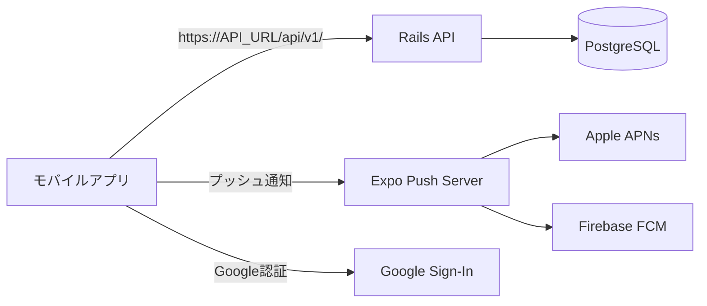
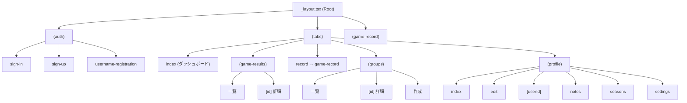
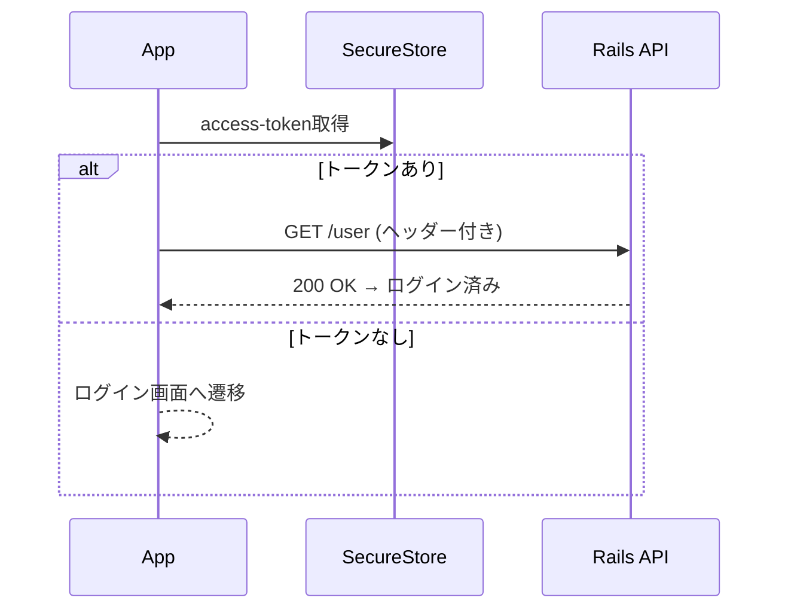

# BUZZ BASE モバイルアプリ

野球の個人成績をランキング形式で共有するモバイルアプリ。Expo SDK 55 + React Native + TypeScript で構築。

## アーキテクチャ

### システム全体図



### 画面構成



### 状態管理

| ライブラリ  | 用途                              | 例                                                           |
| ----------- | --------------------------------- | ------------------------------------------------------------ |
| React Query | サーバーステート（APIキャッシュ） | `useDashboard`, `useGameResults`, `useProfile`               |
| Zustand     | クライアントステート              | `authStore`（認証状態）, `gameRecordStore`（試合記録フロー） |
| SecureStore | トークン永続化                    | `access-token`, `client`, `uid`                              |

### ディレクトリ構成

```
app/                        # Expo Router ファイルベースルーティング
├── (tabs)/                  # タブナビゲーション
│   ├── (game-results)/      # 試合結果 Stack
│   ├── (groups)/            # グループ Stack
│   ├── (profile)/           # マイページ Stack
│   ├── (notifications)/     # 通知 Stack
│   └── index.tsx            # ダッシュボード
├── (game-record)/           # 試合記録フロー（Step1→2→3→Summary）
├── (auth)/                  # 認証画面
└── _layout.tsx              # ルートレイアウト
components/                  # UIコンポーネント（画面ごと + 共通ui/）
hooks/                       # カスタムフック（ドメインごと, 23個）
services/                    # API通信（ドメインごと, 18個）
stores/                      # Zustandストア
types/                       # TypeScript型定義
constants/                   # 定数（API URL等）
utils/                       # ユーティリティ（axiosInstance等）
assets/                      # アイコン・画像
docs/                        # ストアメタデータ等
```

## 設計パターン

### hooks/ でドメインロジックをカプセル化

各ドメインに対応するカスタムフックを提供。React QueryのuseQuery/useMutationをラップし、コンポーネントからAPI通信の詳細を隠蔽する。

```
useAuth        → authService        → /auth/sign_in
useDashboard   → dashboardService   → /v2/dashboard
useGameResults → gameResultService  → /v2/game_results
useProfile     → profileService     → /user
```

### 認証フロー



### ネイティブモジュールの遅延読み込み

Google Sign-In・Push NotificationsはExpo Goで動作しないため、`Constants.appOwnership === "expo"` を検出して `require()` で遅延読み込みする。

## 開発環境のセットアップ

### 前提条件

- Node.js 20.19.4+
- yarn
- EAS CLI（`npm install -g eas-cli`）
- バックエンドが起動済み（`docker compose up`）

### Expo Go（基本機能の確認）

```bash
# iOSシミュレータ
npx expo run:ios
# Androidエミュレータ
npx expo run:android
```

> Google認証・プッシュ通知はExpo Goでは動作しない

### Development Build（ネイティブモジュール含む）

```bash
# iOS実機
eas build --profile development-device --platform ios
# → URLを実機で開いてインストール → yarn start で接続

# Androidエミュレータ
eas build --profile development --platform android
# → エミュレータにインストールされる → yarn start で接続
```

### Preview Build（単体動作、本番API接続）

```bash
eas build --profile preview --platform ios
# → ローカルサーバー不要で単体動作
```

## ビルド・配信（EAS Build）

| プロファイル         | 用途             | API接続先 | 配布方法                |
| -------------------- | ---------------- | --------- | ----------------------- |
| `development`        | シミュレータ開発 | localhost | ローカル                |
| `development-device` | 実機開発         | localhost | Ad Hoc                  |
| `preview`            | テスト配信       | 本番API   | Ad Hoc / TestFlight     |
| `production`         | ストア公開       | 本番API   | App Store / Google Play |

## App Store 提出手順（iOS）

```bash
# 1. 本番ビルド（ビルド番号は autoIncrement で自動加算）
eas build --platform ios --profile production

# 2. ビルド完了後、App Store Connect に提出
eas submit --platform ios --profile production
# → 「Select a build from EAS」を選択 → 最新ビルドを選択

# ※ ビルドと提出を一括で実行する場合
eas build --platform ios --profile production --auto-submit
```

提出後の流れ:

1. Appleの処理完了を待つ（5〜10分、メールで通知）
2. [App Store Connect](https://appstoreconnect.apple.com) → アプリ → 「App Store」タブ
3. 「ビルド」セクションで新しいビルドを選択
4. 「審査に提出」をクリック

### バージョン更新が必要なケース

App Storeで既に承認済みのバージョン（例: `1.0.0`）と同じバージョンでは、新しいビルドを提出できない。
submit時に以下のエラーが出た場合はバージョンを上げる必要がある:

```
90062: The value for key CFBundleShortVersionString [1.0.0] in the Info.plist
file must contain a higher version than that of the previously approved version [1.0.0].
```

対処手順:

```bash
# 1. app.json の version を更新（例: 1.0.0 → 1.0.1）
#    "version": "1.0.1"
#    ※ version はビルド時にバイナリに埋め込まれるため、既存ビルドの再submitでは解決できない

# 2. 再ビルド（buildNumber は autoIncrement で自動加算される）
eas build --platform ios --profile production

# 3. 提出
eas submit --platform ios --profile production
```

バージョニングルール:

- `version`（CFBundleShortVersionString）: ユーザーに表示されるバージョン。App Store承認後は上げる必要がある
- `buildNumber`（CFBundleVersion）: 同一version内のビルド識別子。`autoIncrement: true` で自動管理

## 開発コマンド

`make help` で全コマンドを確認可能。

| コマンド         | 説明                                         |
| ---------------- | -------------------------------------------- |
| `make start`     | Expo開発サーバー起動                         |
| `make ios`       | iOSシミュレータで起動                        |
| `make android`   | Androidエミュレータで起動                    |
| `make typecheck` | TypeScript型チェック                         |
| `make lint`      | ESLint実行                                   |
| `make format`    | Prettier整形                                 |
| `make install`   | 依存関係インストール                         |
| `make prebuild`  | Expoプレビルド（ネイティブプロジェクト生成） |

## 環境変数

開発時は `.env` に設定。EAS Buildでは `eas.json` の `env` で各プロファイルごとに設定。

| 変数名                                 | 説明                    |
| -------------------------------------- | ----------------------- |
| `EXPO_PUBLIC_API_URL`                  | バックエンドAPI URL     |
| `EXPO_PUBLIC_GOOGLE_WEB_CLIENT_ID`     | Google OAuth（Web）     |
| `EXPO_PUBLIC_GOOGLE_IOS_CLIENT_ID`     | Google OAuth（iOS）     |
| `EXPO_PUBLIC_GOOGLE_ANDROID_CLIENT_ID` | Google OAuth（Android） |

## 関連リポジトリ

| リポジトリ                                                        | 説明                         |
| ----------------------------------------------------------------- | ---------------------------- |
| [buzzbase](https://github.com/ippei-shimizu/buzzbase)             | ルートリポジトリ（モノレポ） |
| [buzzbase_front](https://github.com/ippei-shimizu/buzzbase_front) | フロントエンド（Next.js）    |
| [buzzbase_back](https://github.com/ippei-shimizu/buzzbase_back)   | バックエンド（Rails API）    |
